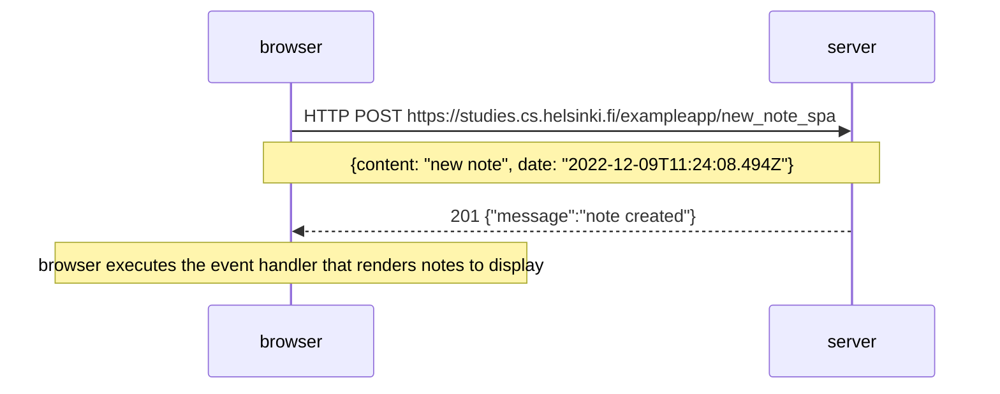

```mermaid
sequenceDiagram
browser->>server: HTTP POST https://studies.cs.helsinki.fi/exampleapp/new_note_spa
note over browser,server: {content: "new note", date: "2022-12-09T11:24:08.494Z"}
server-->>browser: 201 {"message":"note created"}
note over browser: browser executes the event handler that renders notes to display
```
